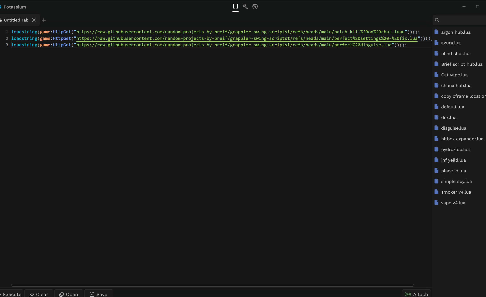

# grappler-swing-scriptst

# scripts
###### -- somoe errors are in disguise so it doesnt load properlyy i only use the reset error code right now so i will not be fixing other issues - i am aware


## disable issue were chatting teleports the charicter to check point
```luau
loadstring(game:HttpGet("https://raw.githubusercontent.com/random-projects-by-breif/grappler-swing-scriptst/refs/heads/main/patch-kill%20on%20chat.luau"))()
```
## to enable my favroute setings
```luau
loadstring(game:HttpGet("https://raw.githubusercontent.com/random-projects-by-breif/grappler-swing-scriptst/refs/heads/main/perfect%20settings%20-%20fix.lua"))()
```
these are the settings i like to use 
i execuute botth at same time using ; to seperatte them.

## disguise gives you a cool avatar
```luau
loadstring(game:HttpGet("https://raw.githubusercontent.com/random-projects-by-breif/grappler-swing-scriptst/refs/heads/main/perfect%20disguise.lua"))()
```
-- how i have it layed out

## if you want to load all refer to
https://raw.githubusercontent.com/random-projects-by-breif/grappler-swing-scriptst/refs/heads/main/grappler_swing.lua
or
you can load it just as a loadstring
```luau
loadstring(game:HttpGet("https://raw.githubusercontent.com/random-projects-by-breif/grappler-swing-scriptst/refs/heads/main/grappler_swing.lua"))()
```
